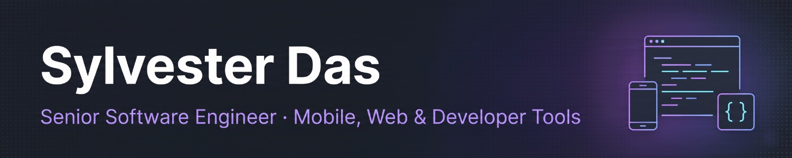

# Hi, I'm Sylvester Das 👋

Senior Software Engineer based in Mumbai. I build privacy-first mobile apps, web platforms and developer tools, and I'm the creator of [MiniFyn](https://github.com/Minifyn).

## 🚀 What I'm building

**[MiniFyn](https://www.minifyn.com)**: privacy-first mobile and web utilities.

- 🛡️ **[ScamGuard](https://www.minifyn.com/scamguard)**: checks suspicious links before you open them ([Android](https://play.google.com/store/apps/details?id=com.minifyn.linkguard) · [Chrome](https://chromewebstore.google.com/detail/scamguard-link-checker/cendbppkhplamddjfnbhgbejnpmfmlbi))
- 🔒 **[CensorFyn](https://www.minifyn.com/censorfyn)**: blurs faces, IDs and personal details in photos and videos, fully offline ([Android](https://play.google.com/store/apps/details?id=com.minifyn.censorfyn))
- ⚡ **[ClipFyn](https://www.minifyn.com/clipfyn)**: exports crisp 1080p 9:16 video for Reels and Shorts ([Android](https://play.google.com/store/apps/details?id=com.minifyn.clipfyn))
- 🔗 **[URL shortener](https://www.minifyn.com)** with QR codes and analytics ([Chrome](https://chromewebstore.google.com/detail/minifyn-url-shortener/lppblpgaeklhkcjlonkmldjfocagjifc)), plus in-browser [developer tools](https://www.minifyn.com/tools)

**Open source**: [`@gykh/caesar-cipher`](https://www.npmjs.com/package/@gykh/caesar-cipher) and other utilities under [get-your-knowledge-here](https://github.com/get-your-knowledge-here).

## 🛠️ Tech I work with

- **Mobile:** Flutter, Dart, on-device ML
- **Web:** TypeScript, React, Next.js, Tailwind CSS
- **Backend:** Go, Node.js, Python, REST
- **Cloud & data:** Firebase, Google Cloud, Vercel, Docker, PostgreSQL, Redis
- **Tooling:** GitHub Actions, Chrome extensions

## 📬 Get in touch

Reach me through [sylvesterdas.com](https://www.sylvesterdas.com) or [LinkedIn](https://www.linkedin.com/in/sylvesterdas). Found a bug in a MiniFyn app? Open an issue in [minifyn-issues](https://github.com/Minifyn/minifyn-issues).
